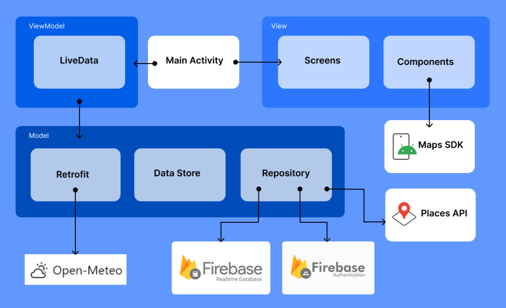

#MyWave

## Introduzione

MyWave è un’applicazione Android per la ricerca e analisi degli Spot per sport marittimi.
In tempo reale è possibile tenere traccia delle previsioni del tempo dei luoghi preferiti per
programmare al meglio le proprie attività sportive. Nello specifico l’app permette di:

● Navigare sulla mappa per cercare punti di interesse da salvare

● Gestire la lista degli spot preferiti e modificarne i dettagli

● Controllare le previsioni del tempo per i diversi spot e valutare gli spot con le migliori
condizioni per programmare le proprie escursioni

● Collegarsi a Google Maps per aprire un itinerario con destinazione un luogo tra i
preferiti

● Creare un account per salvare i propri spot ed evitare la perdita dei dati

● Personalizzare i dati meteorologici mostrati tramite le impostazione del profilo

Al primo avvio l’app richiede la creazione di un account per iniziare ad utilizzare le
funzionalità e dalla schermata di profilo l’utente può personalizzare le impostazioni del
proprio account.
Per lo sviluppo sono stati utilizzati il linguaggio Kotlin, il framework Jetpack Compose, il
build system Gradle, e l’IDE Android Studio.

## Architettura

Per sviluppare il nostro progetto abbiamo utilizzato l'architettura Model-View-ViewModel
(MVVM) come raccomandato dalle linee guida di Google. Nella nostra implementazione, i
"Model" sono stati progettati per interagire con una serie di servizi esterni, garantendo
un'interfaccia fluida e robusta con diverse API e piattaforme.

SDK di Google Maps ci ha permesso di fornire funzionalità di mappatura avanzate e
interattive; abbiamo inoltre utilizzato l'API di Google Places per accedere a dati dettagliati su
luoghi specifici, migliorando così l'esperienza utente con informazioni aggiuntive e pertinenti.
L'integrazione con Open-Meteo API ci ha consentito di incorporare previsioni meteorologiche
precise e aggiornate.

Per quanto riguarda la gestione degli account degli utenti e l’archiviazione dei dati, ci siamo
affidati a Firebase Authentication, scelto per la sua capacità di offrire un sistema di
autenticazione sicuro, e Firebase RealTime Database il quale permette di gestire e
sincronizzare i dati in tempo reale, assicurando un'esperienza utente fluida e reattiva.

